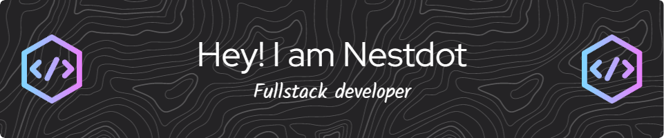

##  About me

  

  

##  Technologies I worked with

<h3 align="center">Languages</h3>

<h3 align="center">Frameworks</h3>

<h3 align="center">IDE</h3>

<h3 align="center">Platforms</h3>

##  Recent activity

  

##  Support my work

<a href="https://docs.google.com/document/d/1g09CNLsvB0k_cPfbdq3n8zg9l59za2zOs2G2TJIMNmo/edit?usp=sharing" target="_blank" rel="noopener noreferrer">
<a href="https://docs.google.com/document/d/1_Ok4WOaIPC-sGRAh6f69T9JJtISn40jmsXaRFvEdFM0/edit?usp=sharing" target="_blank" rel="noopener noreferrer">
<a href="https://docs.google.com/document/d/1XUVlRFalX5ya25iyQwuEzao_wDR9e9ED_4znVi7Y844/edit?usp=sharing" target="_blank" rel="noopener noreferrer">
<a href="https://docs.google.com/document/d/19mozdfs8HrGl9y38wTUQnBNYKzf9D57LG4WgjhCYKWg/edit?usp=sharing" target="_blank" rel="noopener noreferrer">
<a href="https://docs.google.com/document/d/1rI42FxSsfw70OhPpIxnC89NYQT_QyzW8sUiZPyxJ07s/edit?usp=sharing" target="_blank" rel="noopener noreferrer">
<a href="https://docs.google.com/document/d/12glwknL1t8o4y11eCxJDjeHcvV9H7-gKBJTvxDTM9es/edit?usp=sharing" target="_blank" rel="noopener noreferrer">

  

##  Latest followers

